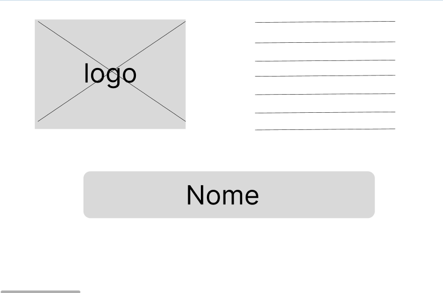
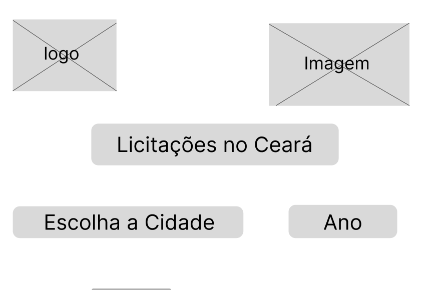
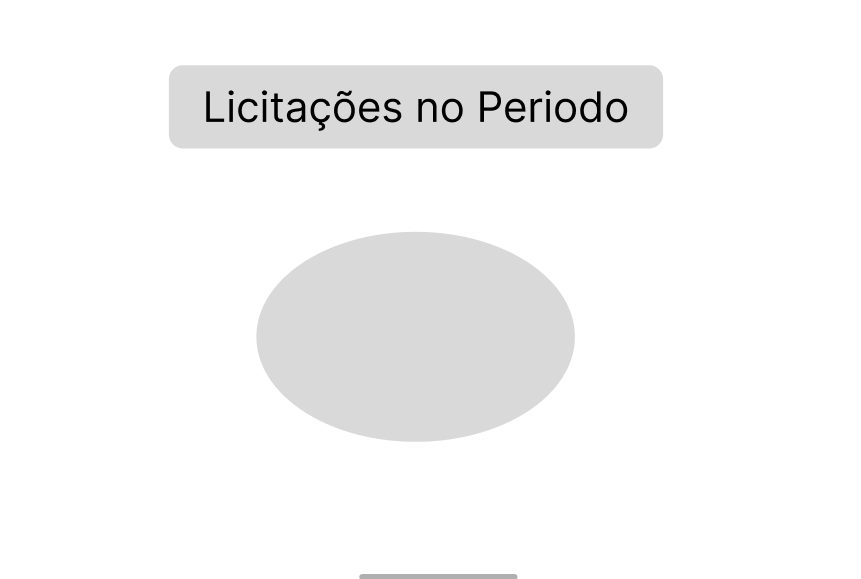
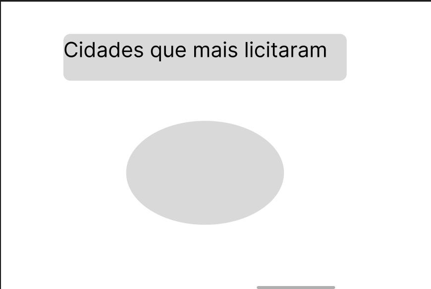
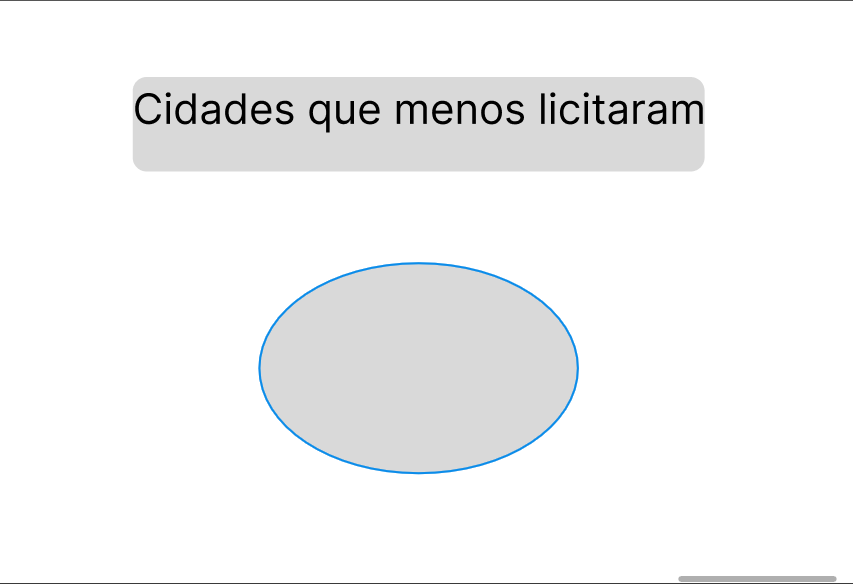

| Data       | Versão | Descrição                      | Autor |
| :--------: | :----: | :----------------------------: | :-------: |
| 09/10/2023 |  0.1   |     Abertura do documento      | [Giovana Barbosa ](https://github.com/gio221)  |

## 1.Introdução

Nesta documentação, abordaremos os conceitos, processos e melhores práticas envolvidos na criação, uso e benefícios dos prototipo de baixa e alta fidelidade. Vamos explorar como eles podem ser ferramentas cruciais para o desenvolvimento de produtos de alta qualidade e eficácia, economizando tempo e recursos, além de garantir que as necessidades dos usuários sejam atendidas de maneira satisfatória.

## 2.Protótipo de Baixa Fidelidade

Criado por [Giovana Barbosa ](https://github.com/gio221)  

## 3.Protótipo de Alta Fidelidade

Desenvolvido a partir da ideia inicial dos protótipos de baixa fidelidade.

[Clique aqui](https://www.figma.com/proto/4NufbdvSRVBk144XWrsgFA/GuiaUnB?type=design&node-id=8-18934&scaling=scale-down&page-id=1%3A43095&starting-point-node-id=8%3A18934&show-proto-sidebar=1) para acessar o protótipo no Figma.

Criado por [Thiago Freitas](https://github.com/thiagorfreitas) e [Arthur Gabriel](https://github.com/ArthurGabrieel)