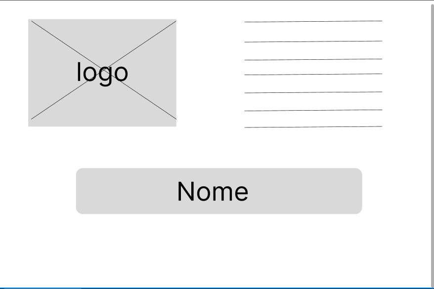
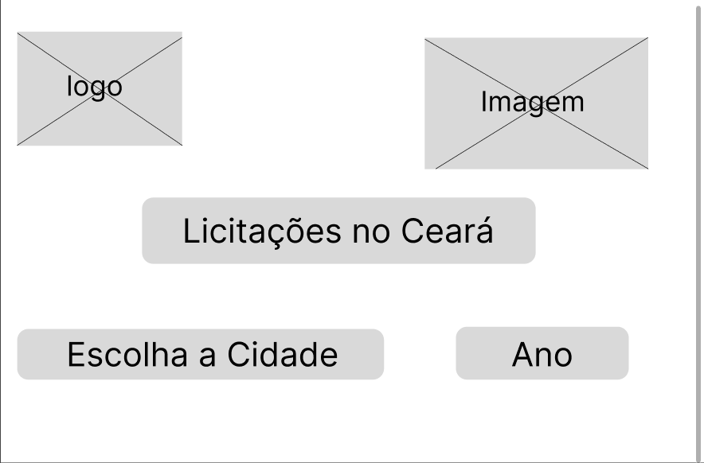

| Data       | Versão | Descrição                      | Autor |
| :--------: | :----: | :----------------------------: | :-------: |
| 09/10/2023 |  0.1   |     Abertura do documento      | [Giovana Barbosa ](https://github.com/gio221)  |

## 1.Introdução

Nesta documentação, abordaremos os conceitos, processos e melhores práticas envolvidos na criação, uso e benefícios dos prototipo de baixa e alta fidelidade. Vamos explorar como eles podem ser ferramentas cruciais para o desenvolvimento de produtos de alta qualidade e eficácia, economizando tempo e recursos, além de garantir que as necessidades dos usuários sejam atendidas de maneira satisfatória.

## 2.Protótipo de Baixa Fidelidade

Criado por [Giovana Barbosa ](https://github.com/gio221)  

