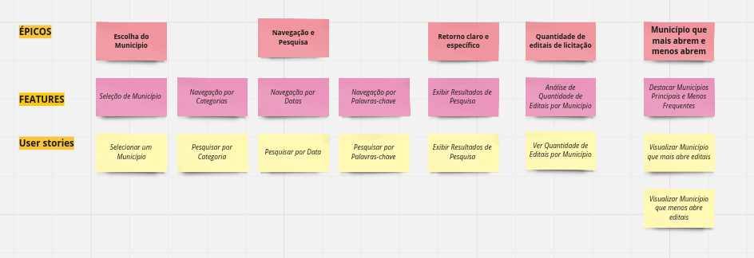

Criação do arquivo de Story Map

## Histórico de Versões

| Data       | Versão | Descrição                                 | Autor             |
| :--------: | :----: | :----------:                              | :---------------: |
| 07/10/2023 |  0.1   | Criação do arquivo de Story  Map             | [Júlia Takaki](https://github.com/juliatakaki)

### Quadro das funcionalidades
Um User Story Map é uma ferramenta visual que ajuda a equipe a entender e planejar as funcionalidades de uma aplicação de maneira mais estruturada e centrada no usuário. Ele é particularmente útil no contexto de desenvolvimento ágil, como o Scrum. O quadro abaixo apresenta os principais conceitos envolvidos, como cards épicos, features e histórias de usuário (HU's).

## Explicação do diagrama

### Épico: Escolha do município

#### Feature: Seleção de Município
- Os usuários podem escolher o município do Estado do Ceará desejado.

#### História de Usuário (HU): Selecionar um Município
- Como um usuário, quero poder selecionar o município do Estado do Ceará que desejo para ver os editais de licitação relacionados a esse município.

#
### Épico: Navegação e Pesquisa

#### Feature: Navegação por Categorias
- Os usuários podem navegar facilmente pelo Diário Oficial, usando categorias.

#### Feature: Navegação por Datas
- Os usuários podem navegar facilmente pelo Diário Oficial, usando datas.

#### Feature: Navegação por Palavras-chave
- Os usuários podem navegar facilmente pelo Diário Oficial, usando palavras-chave.

#### História de Usuário (HU): Pesquisar por Categoria
- Como um usuário, quero poder navegar pelo Diário Oficial, escolhendo uma categoria específica para encontrar editais de licitação relacionados a essa categoria.

#### História de Usuário (HU): Pesquisar por Data
- Como um usuário, quero poder navegar pelo Diário Oficial, escolhendo uma data específica para encontrar editais de licitação publicados nessa data.

#### História de Usuário (HU): Pesquisar por Palavras-chave
- Como um usuário, quero poder pesquisar no Diário Oficial usando palavras-chave relevantes para encontrar editais de licitação relacionados às minhas necessidades.

#
### Épico: Retorno claro e específico

#### Feature: Exibir Resultados de Pesquisa
- O retorno da pesquisa deve ser claro e especificado para o usuário, mostrando a citação e a data em que a palavra-chave foi referenciada.

#### História de Usuário (HU): Exibir Resultados de Pesquisa
-Como um usuário, quero ver os resultados da minha pesquisa de forma clara e específica, incluindo a citação relevante e a data em que a palavra-chave foi referenciada.

#
### Épico: Quantidade de editais de licitação

#### Feature: Análise de Quantidade de Editais por Município
- Os usuários podem analisar a quantidade de aberturas de editais de licitação por município em determinado período de tempo.

#### História de Usuário (HU): Ver Quantidade de Editais por Município
-Como um usuário, quero poder visualizar a quantidade de editais de licitação abertos por cada município do Estado do Ceará em um período de tempo específico.