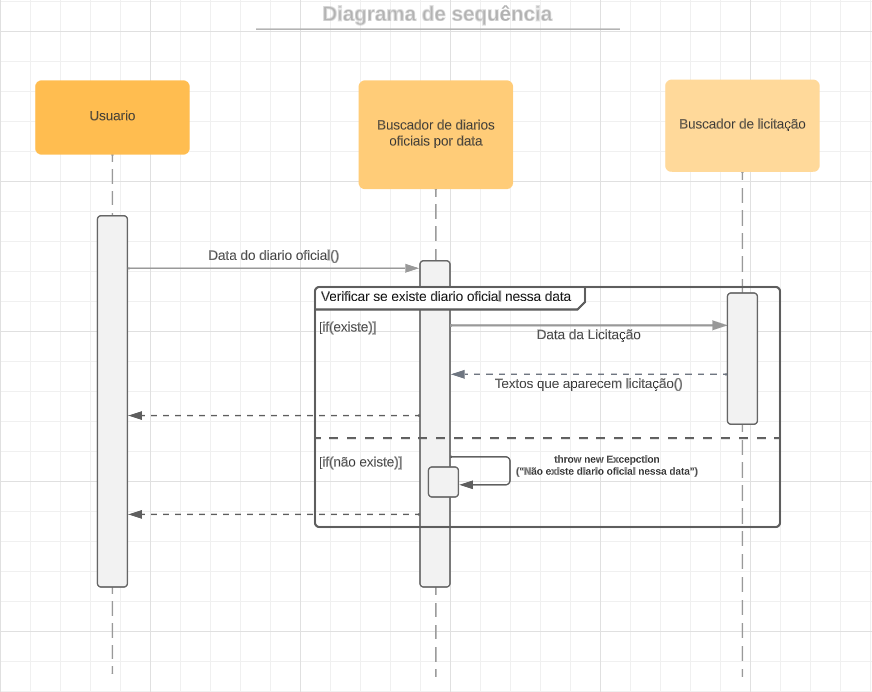

## Histórico de revisão

  |Data|Versão|Alteração|Autor|  
  |----|------|---------|-----|  
  |08/10/2023|0.1|Abertura do documento de Arquitetura|[Rafael Bonach](https://github.com/RafaBonach)|
  
  
## 1. Introdução
## 1.1 Finalidade
Este documento tem como finalidade apresentar a arquitetura do projeto LicitaX, de forma que fique de fácil entedimento a estrututra arquitetural do projeto, e sejam mostradas todas as decisões relacionadas a ela.
  
## 1.2 Escopo
Essa documentação engloba as funções visadas pelo projeto, além das tecnologias usadas, seu diagrama de relações e casos de uso. Engloba também algumas outras informações técnicas como características de desempenho e qualidade. O projeto é desenvolvido por alunos da UNB-FGA, na disciplina MDS.

## 1.3 Diagrama de Sequências UML
